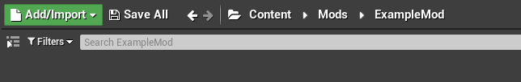
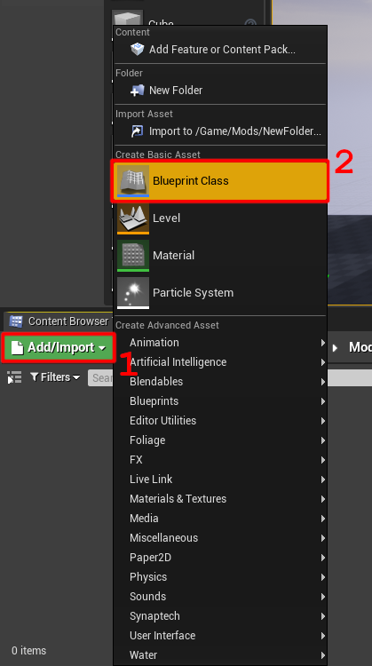
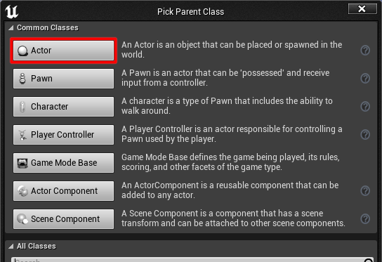
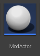
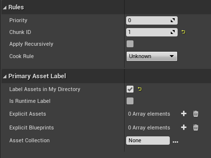
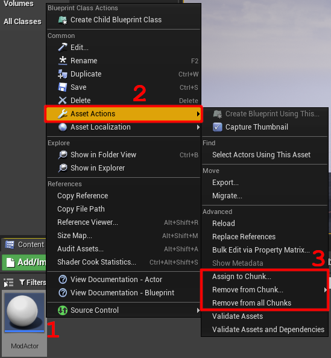
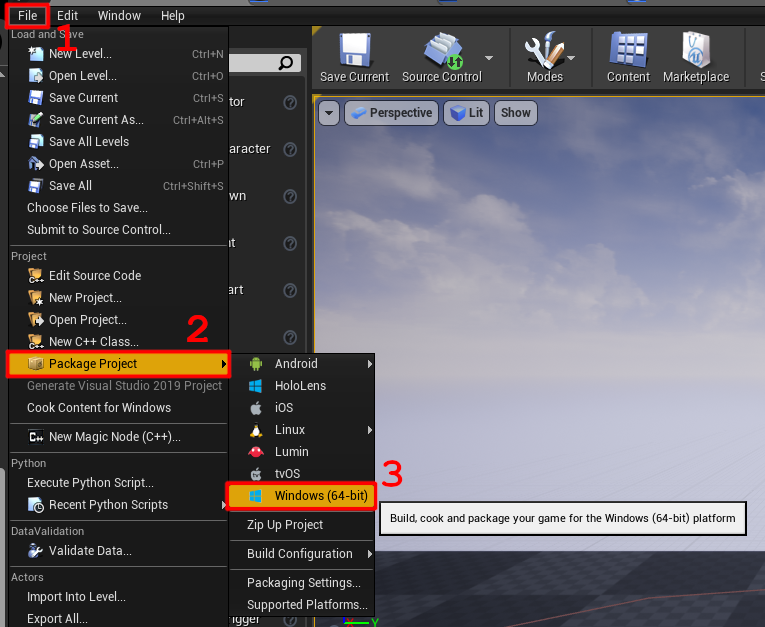

# Creating your Mod
## Creating your ModActor
Now that you are inside Unreal Engine and everything is set up, now its time to create your mod. Inside the base content folder of your project, create a new "Mods" folder and navigate into it.

This is where you'll need to decide the name you want to give your mod (for example, `ExampleMod`). Make sure to remember it. Create a folder inside the Mods folder, and give it the name of your mod (`ExampleMod`) and navigate into it. This is where all of your mod content will go.

Inside the folder, create a new blueprint class:

Choose its parent to be the actor class

Finally, name it "ModActor":

You've now made your **ModActor**! This is the central point for your entire mod. When UE4SS detects your ModActor in your mod, it automatically spawns it into the world, so to make it run some code, just open up the ModActor (double-click) and navigate to the Event Graph and start attaching code to the `Event BeginPlay` node.

This all you need to make your mod work! From this ModActor, you can spawn new actors, create widgets, add brand new mechanics, access and modify game mechanics or systems using [ghostmappings](./using-ghostmappings), and more.

Additionally, this folder your ModActor is in is all yours to use. You can add whatever assets you want so that they can be used in your mod. (It's important to be aware that the filesystem of your pak file gets merged with the filesystem of VotV, which means that if both have an asset inside the file located at the same path, a conflict could occur. This is why its recommended to keep most of your included assets inside your mod folder).

:::tip A peek into the blueprint modloader
The part of UE4SS that spawns your blueprint ModActor and runs the PostBeginPlay function is actually a built-in lua mod called "BPModLoaderMod". You can look inside your mod launcher or modding installation's files to check out the script yourself!

A note on extra features of the BP mod loader

The mod loader also looks for custom events or functions inside the ModActor named "PreBeginPlay" and "PostBeginPlay" and attempts to execute them at certain points in the loading process if they exist.

PreBeginPlay is useful if you want to do certain actions before gameplay officially starts, but PostBeginPlay does not seem to be that functionally different from the built-in BeginPlay event. Make of these functions what you will.

:::

Next up are the directions for packaging your mod so that you can play it.

## Assigning your mod a chunk ID
To get your mod runnable, you need to pack your mod assets into a `.pak` file so that the game can load it.

This is one of the trickiest part of working with Unreal Engine. For your mod, you want to include only *your* assets in a `.pak` file, without any of the extra stuff that Unreal includes in the package. This is where we utilize a ability of Unreal Engine called _"chunking"_.

If you remember back to the directions for setting up Unreal Engine, you were told to enable [some settings](./setting-up-unreal#configuring-editor-and-project-settings). Those settings tells the Unreal to package different assets into separate `.pak` files when we ask it, instead of it just putting it all in one file.

The next step is telling which files to go into which pak file. This is done by assigning a "chunk id" to specific files, or making every file in a folder

### Assigning entire folders via Asset Labels (Recommended)
To create one, create a new asset > Miscellaneous > Data Asset, and then from these create a "Primary Asset Label".\
When you open it up, set `Chunk ID` to the chunk ID you want to assign your assets to, and it's also recommended to enable the `Label Assets in My Directory` setting so it applies the chunk IDs to the current folder and all subfolders. **Do not** enable the `Apply Recursively` setting as it may cause issues.

Some example settings for an asset label:

### Assigning to single assets via Asset Actions
This is a method to apply chunk IDs to individual assets.

Use "Assign to Chunk" to apply a chunk ID to an asset, "Remove from Chunk" to remove a chunk ID, and "Remove from all Chunks" to remove all chunk IDs from the asset.

## Packaging your Mod
Now that your mod is all set up, and everything is set up to package properly, all you need to do is package your project.

Switch to the main page in Unreal Engine, and then click the "File" button on the menu bar up top. Under the "Project" section of the dropdown menu, hover over the "Package Project" button. Head over to "Windows (64-bit)" and click on it. A file explorer will open and prompt you to select a folder. This is the folder that the packaged project will be placed into.

I recommend creating a "Output" folder in your project's files and packaging the project there, but you can do whatever you want. Once you hit "Select Folder", Unreal will begin packaging your project. This process can take a while, but once its done it will play a chime to notify you that it has finished.

Navigate into your output folder, then into `/WindowsNoEditor/VotV/Content/Paks` to find your final pak files. Your mod will be contained within the `pakchunk<your mod's chunk id>-WindowsNoEditor.pak` file. If the file doesn't exist, then consult with [the below page](#ensuring-your-mod-is-being-included-when-packaging) for a *possible* solution.

Now just take your pak file and name it `<your mod name>.pak`, and it is now all set to be ran by UE4SS! Check out [running your mod](./running-your-mod) to learn how to run your mod.

## (Troubleshooting) Ensuring your mod is being included when packaging
Unreal engine likes to skip packaging assets that are not referenced anywhere. You can check if your asset was properly packaged by opening your mod's `.pak` file with FModel to check if the asset is there.

To make sure that your assets get packaged: inside Unreal Engine, stick your asset in a blank map or create a new blueprint actor and reference your asset's class inside it in any way. These maps/assets do not need to also be included in your chunk, they just need to exist and be saved in the project somewhere. (I like to keep these assets in a "maps" folder at the base of the project)
