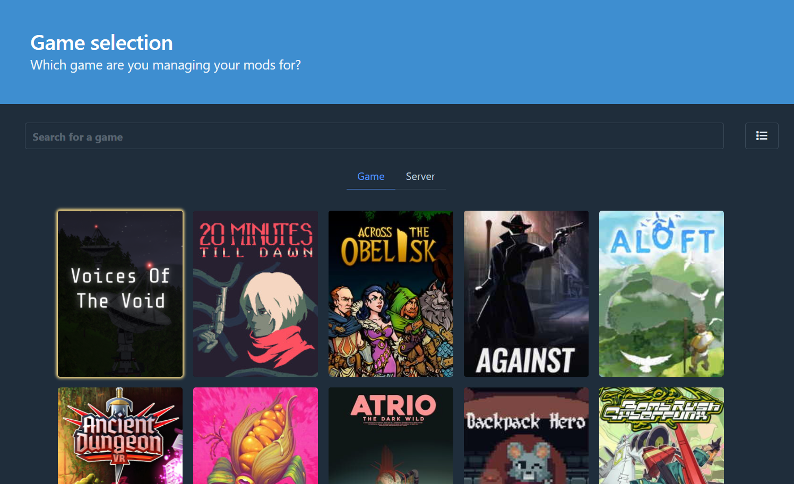
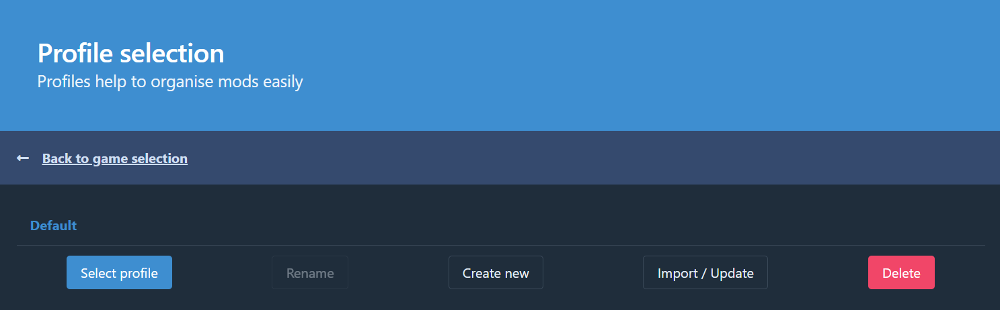
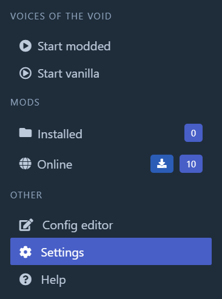
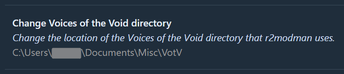
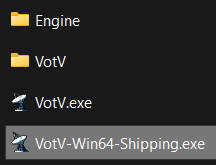
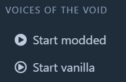
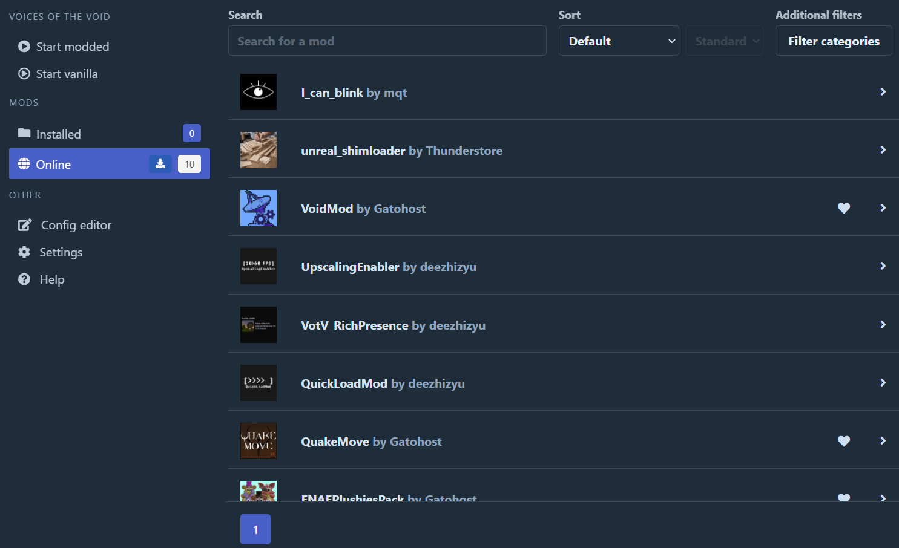
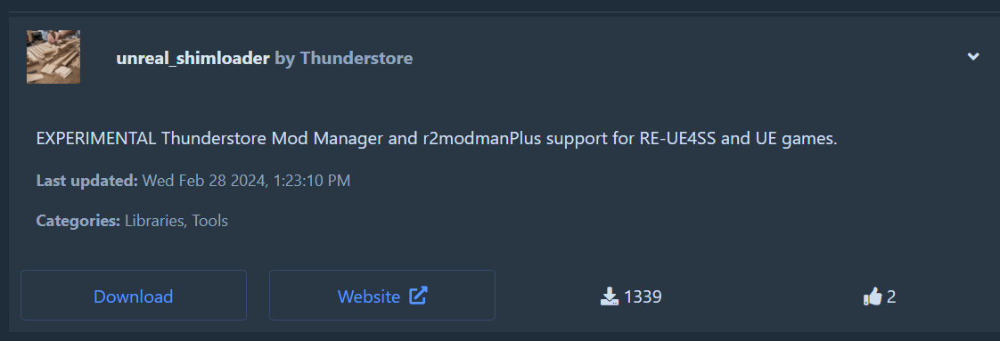
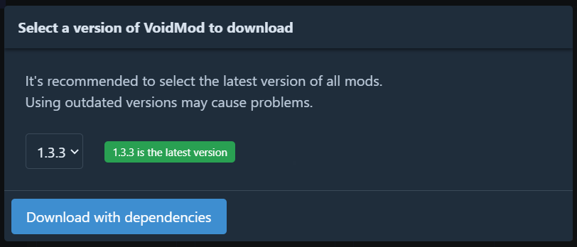
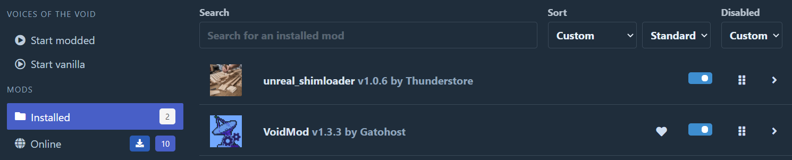

# Installing Mods using a Mod Manager
## Prerequisites
Before we start, make sure you have:

- [A Clean, Unmodified Install of Voices of the Void](https://mrdrnose.itch.io/votv)
- [Thunderstore App](https://www.overwolf.com/oneapp/Thunderstore-Thunderstore_Mod_Manager)

or, if you hate Overwolf:

- [R2ModManager (3.1.47 or Above)](https://github.com/ebkr/r2modmanPlus/releases/latest)

Voices of the Void mods are mostly tested on Windows. Other platforms have varying levels of support.

## Setting Up the Mod Manager
After you have installed the game as well as your choice of Mod Manager (R2ModManager and Thunderstore are practically the same thing), open your Mod Manager and wait for everything to load. You likely will be prompted to select a game from a large list. Simply use the search bar to find "Voices of the Void" and select it.

Once the Mod Manager finishes loading, you will be prompted to select a Profile. I highly recommend you create a new profile, separate from the Default profile. Either way, choose your profile and click "Select Profile"

You'll then be presented with a "Installed Mods List". Before we cover installing mods, you'll need to change some settings. Otherwise, attempting to load the game will result in nothing or an error.

Begin by clicking on the Settings option on the sidebar:

Scroll down in the settings, and find the option "Change Voices of the Void Directory".

(Yours likely will not have a directory already listed)

<blockquote>

<strong>Notice When Selecting Your VotV Directory</strong>

<i>If you are prompted to select "VotV-Win64-Shipping.exe":</i>

Navigate to your Voices of the Void installation. Copy "VotV.exe", and rename the copied file to "VotV-Win64-Shipping.exe". Select the copied file. This is because of a misconfiguration in your version of the mod manager that requires an executable named "VotV-Win64-Shipping"

If you are prompted to select "VotV.exe":

Navigate to your Voices of the Void installation. Select the file "VotV.exe".

</blockquote>

Select the executable recommended above, and you're done!

Clicking either Start button should properly boot the game.

## Installing Mods
Voices of the Void Modding generally requires Two Mods to function properly:

- [Unreal Shimloader (By Thunderstore)](https://thunderstore.io/c/voices-of-the-void/p/Thunderstore/unreal_shimloader/) : This mod is a specialized version of "[RE-UE4SS](https://github.com/UE4SS-RE/RE-UE4SS)" meant to allow Mod Managers to load mods for Unreal Engine Games. It is <i>REQUIRED</i>.
- [VoidMod (By Gato)](https://thunderstore.io/c/voices-of-the-void/p/Gatohost/VoidMod/) : This mod is a generally standardized framework for Voices of the Void modding, with useful functions, features and configuration control. It is <i>highly recommended</i> as most mods require it as a dependency. The VotV Modding Wiki uses VoidMod in its modding tutorials.

To install a Mod, navigate to the "Online" Mods section, where you will be presented with a list of currently available Mods. These mods are hosted on the [Thunderstore Website](https://thunderstore.io/c/voices-of-the-void/).

Once you've found a mod you would like to install, click on the mod. It should show you a description and some options.

Simply click "Download", and when prompted to select a version, generally the latest version is the proper one. Just click "Download with Dependencies". If you do not have a required mod, then this should install the required mods (For Example, properly set up mods generally automatically install <i>Unreal Shimloader</i> and <i>VoidMod</i> as well as the mod).

You can view currently installed mods and uninstall or disable them from the Installed Mods section. Enabled mods will load with the game when you press the "Start Modded" button.

