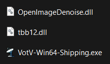
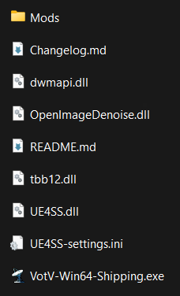
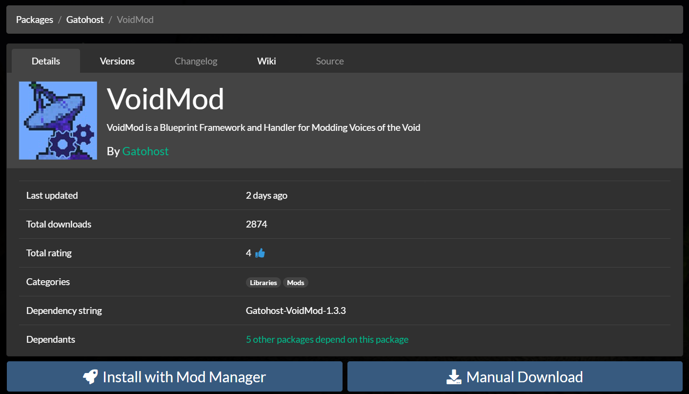
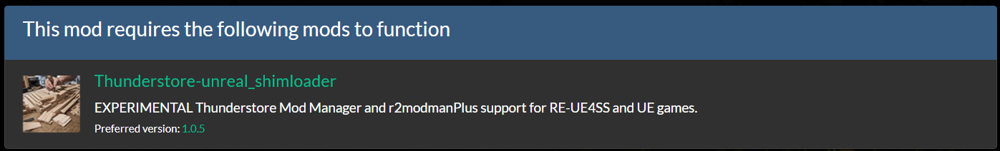

# Installing Mods Manually
:::danger Cognitohazard Warning
This is not recommended for new players.

The community will be less likely to assist with issues related to manual installations, and you can possibly ruin your game installation. If you want to modify your game, it is preferred that you follow the [Thunderstore/R2ModManager Installation Tutorial](./install-modman).

Proceed at your own risk.
:::

## Prerequisites
Before we start, make sure you have:

- [A Clean, Unmodified Install of Voices of the Void](https://mrdrnose.itch.io/votv)
- [Unreal Shimloader (By Thunderstore)](https://thunderstore.io/c/voices-of-the-void/p/Thunderstore/unreal_shimloader/)

or, for Developers, I recommend using the direct equivalent of Shimloader:

- [RE-UE4SS (UE4SS_v#.#.#.zip)](https://github.com/UE4SS-RE/RE-UE4SS/releases/latest)

Voices of the Void mods are mostly tested on Windows. Other platforms have varying levels of support.

## Setting Up UE4SS/Shimloader
After you have installed the game, download the Latest [RE-UE4SS](https://github.com/UE4SS-RE/RE-UE4SS/releases/latest).

Extract the Contents of the `Thunderstore-unreal_shimloader-#.#.#.zip` or `UE4SS_v#.#.#.zip` into `VotVDirectory/VotV/Binaries/Win64`.

*Before Extracting:*



*After Extracting (UE4SS Example, Shimloader is similar):*



After extracting the files, open the `/UE4SS/Mods/` folder (or just `/Mods/` if you use UE4SS directly). Open the file `mods.txt`. You'll be presented with something like this:

```
CheatManagerEnablerMod : 1
ActorDumperMod : 0
ConsoleCommandsMod : 1
ConsoleEnablerMod : 1
SplitScreenMod : 0
LineTraceMod : 0
BPModLoaderMod : 1
BPML_GenericFunctions : 1
jsbLuaProfilerMod : 0


; Built-in keybinds, do not move up!
Keybinds : 1
```

Ensure that `BPModLoaderMod` is set to `1`, just like in the above example.

<blockquote>
**IF YOUR GAME DOES NOT START UP PROPERLY NOW**

Simply, instead of running the `VotV.exe` you are used to, run the `VotV-Win64-Shipping.exe` in `/VotV/Binaries/Win64/`. This should fix any errors with launching the game, mainly present on older versions of Shimloader.
</blockquote>

## Installing Mods
Voices of the Void Modding generally requires Two Mods to function properly:

- [Unreal Shimloader (By Thunderstore)](https://thunderstore.io/c/voices-of-the-void/p/Thunderstore/unreal_shimloader/) : This mod is a specialized version of [RE-UE4SS](https://github.com/UE4SS-RE/RE-UE4SS) meant to allow Mod Managers to load mods for Unreal Engine Games. **By this point, you've already installed Shimloader/UE4SS.**
- [VoidMod (By Gato)](https://thunderstore.io/c/voices-of-the-void/p/Gatohost/VoidMod/) : This mod used by many Voices of the Void mods. It is highly recommended as most mods require it as a dependency. This wiki also has tutorials for creating mods with VoidMod.

To install a Mod, go to [Thunderstore's Website, Specificaly the Voices of the Void Category](https://thunderstore.io/c/voices-of-the-void/).

Find any mod you want to download and open it in a new tab. You'll be presented with a page similar to this:



Simply click on "Manual Download", which should download a ZIP archive containing the mod's contents.

<blockquote>
***Some mods depend on other mods!***

Make sure you install Dependencies, which are listed below the Download buttons. If your game crashes whilst loading, chances are you are missing a dependency or have outdated mods! (Unless you get the generic `Fatal Error!`, which is an odd bug with modding)


</blockquote>

Once you've downloaded your mods, you will be greeted with a ton of archive files to be extracted.

Mods created after `February 28th, 2024`, downloaded from Thunderstore, most likely use the following new format:

```
📁 MOD_AUTHOR-MOD_NAME-#.#.#.zip
    📄 manifest.json
    📄 README.md
    🖼️ icon.png
    📁 mod
        📄 enabled.txt
        📁 scripts
            📄 main.lua
        📁 dll
            📄 main.dll
    📁 pak
        📄 MOD_NAME.pak
    📁 cfg
        📄 MOD_AUTHOR-MOD_NAME-cfg.json
```

To install this type of mod:

- Put `.pak` Files from `/pak/` into `/Game/VotV/Content/Paks/LogicMods/`
- Put the `mod` Directory into `/Game/VotV/Binaries/Win64/Mods/`. Rename it to the name of the mod.

:::note Editor's Note
VotV modding is primarily Blueprint based, so I have not experimented with the `mod` directory. Please correct me through Discord (creepycats) if you believe I have messed up.
:::

<blockquote>
Installing Older Mods

Out of Date Mods will instead generally come with a `VotV` folder in the zip. These mods are not compatible with Mod Managers.

To install the old format mods (*HIGHLY* Recommended you do not install these):

- Drag the `VotV` Directory into your `/Game/` path. This should place the needed mod files where they need to go, combining with the already existing `/Game/VotV/` path.
</blockquote>

