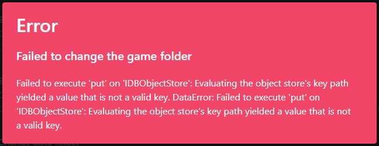

# "Failed to execute 'put'"
This is an bug with modmanagers that can occasionally happen, typically when attempting to change the VotV folder in the settings. 

To fix the error, close the mod manager you are using, then:
* If you use r2modman, go to the folder `%appdata%\r2modman` and delete the IndexedDB folder.
* If you use the Thunderstore app, go to the folder `%localappdata%\Overwolf\CefBrowserCache\Default` and delete the IndexedDB folder.

Be aware that deleting this folder may clear your settings and some other cached settings.

Once this is done, reopen the mod manager and the issue should no longer occur.
