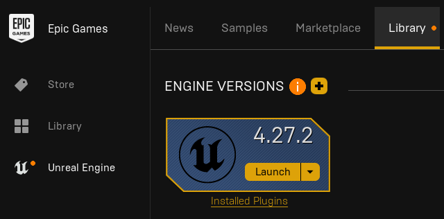
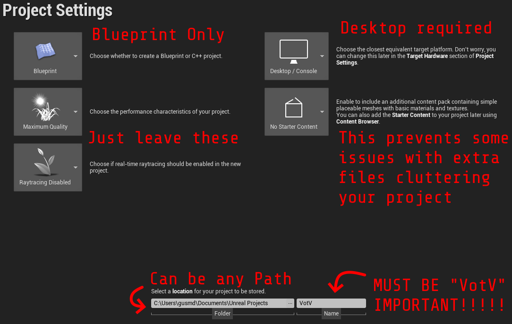

import Tabs from '@theme/Tabs';
import TabItem from '@theme/TabItem';

# Setting up Unreal Engine

## Installing Unreal Engine 4.27.2
Voices of the Void was built on [Unreal Engine 4.27.2](https://www.unrealengine.com/en-US/download), so in order to create mods, you will need to install it using the Epic Games Launcher. Make sure you choose to install 4.27.2, but any 4.27.X version is likely to work just as well.

Be advised that installing the Engine will require around 40-45 gigabytes of storage space.



After installing Unreal Engine, click Launch.

## Preparing the Mod Project
After launching Unreal Engine, you want to create a new project. You'll be greeted by a "Select or Create New Project" window, where you want to select "Games", and click next.


Select Blank, and then Copy the settings you see in the following image:



Let Unreal Engine create your project, then close out so you can install VictoryBPLibrary.

## Configuring editor and project settings
We will need to change a couple settings to setup our project for modding.

Inside your project, click "edit" on the menu bar and open both the "Editor Preferences" and "Project Settings" menu.

### Editor Preferences
Enable the setting "Allow ChunkID Assignments"

### Project Settings
Enable the setting "Generate Chunks"\
Disable the setting "Share Material Shader Code"


## Installing VictoryBPLibrary
:::warning
Make sure your Unreal Engine project is closed while making these changes.
:::
VictoryBPLibrary is a plugin that provides over a hundred useful different nodes to the blueprint editor, and it is used by many modders and the developers of VotV due to its utility, so it is heavily recommended.

You can chose to install the plugin to a single project, or have it installed globally so that it becomes available in every project you create.

<Tabs groupId="installing-victorybp">
<TabItem value="local-install" label="Installing to a Project" default>
First, download the `VictoryPlugin27.zip` from [here](https://www.mediafire.com/file/1snjjuxuoqs6b4g/VictoryPlugin27.zip/file).

You'll want to extract the ZIP file to `VotV/Plugins/VictoryBPLibrary`

```
📁 VotV
    📄 VotV.uproject
    📁 Plugins *
        📁 VictoryBPLibrary *
            📄 Zip Contents Go Here...
    📁 Config
    📁 Content

* - Make This Folder Yourself
```

Afterwards, open your project file in Unreal Engine, and Enable Victory Plugin.

Use the following image as a guide:


</TabItem>
<TabItem value="global-install" label="Installing Globally">
First, download the `VictoryPlugin27.zip` from [here](https://www.mediafire.com/file/1snjjuxuoqs6b4g/VictoryPlugin27.zip/file).

Find the location of your Unreal Engine installation, You'll want to extract the ZIP file to `UE_4.27/Engine/Plugins/Marketplace/VictoryBPLibrary`. (If the Marketplace folder does not exist, create it.)

```
📁 Marketplace
    📁 VictoryBPLibrary *
        📄 VictoryBPLibrary.uplugin
        📁 Binaries
        📁 Intermediate
        📁 Resources
        📁 Source

* - Make This Folder Yourself
```

Now, open any project in Unreal Engine, and the Victory Plugin should be available in the plugins menu.

Additionally, if you want the plugin *enabled* by default in every project you create or use, you can open the `VictoryBPLibrary.uplugin` file in a text editor and add `"EnabledByDefault": true,`

For example:
```diff
    ...
    "CreatedByURL": "http://www.ue4code.com",
    "DocsURL": "http://www.ue4code.com",
    "MarketplaceURL": "http://www.ue4code.com",
    "SupportURL": "http://www.ue4code.com",
    "EngineVersion": "4.27.0",
    "CanContainContent": false,
    "Installed": true,
+   "EnabledByDefault": true,
    "Modules": [
    ...
```
</TabItem>
</Tabs>

## Fixing Sounds
Playing sounds does not work out of the box. To fix this, open the folder your Unreal Engine project is in, open the `Config` folder, and open `DefaultEngine.ini` in a text editor. Scroll to the bottom of the file, and insert this text:

```
[/Script/WindowsTargetPlatform.WindowsTargetSettings]
MaxSampleRate=0.000000
HighSampleRate=0.000000
MedSampleRate=0.000000
LowSampleRate=0.000000
MinSampleRate=0.000000
CompressionQualityModifier=0.000000
AutoStreamingThreshold=0.000000
```
