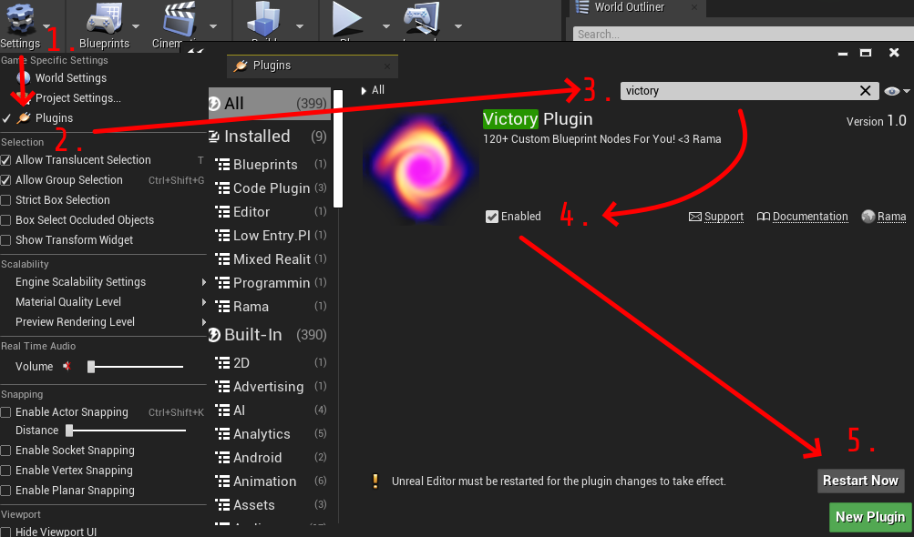

# Setting Up VoidMod2

:::note Dr. Dee's Note
This page is meant for individuals who want to start creating mods using the VoidMod2 framework.
:::

## Installing Unreal Engine 4.27.2

Voices of the Void was built on [Unreal Engine 4.27.2](https://www.unrealengine.com/en-US/download), so in order to create VoidMod mods, you will need to install it using the Epic Games Launcher. Make sure you choose to install 4.27.2, but any 4.27.X version is likely to work just as well.


After installing Unreal Engine, click Launch.

## Preparing the Mod Project

:::note Dr. Dee's Note
You will ONLY do this step once. Mods are meant to be developed all in the same single project, NOT as separate installations per mod.
:::

After launching Unreal Engine, you want to create a new project. You'll be greeted by a "Select or Create New Project" window, where you want to select "Games", and click next.


Select Blank, and then Copy the settings you see in the following image:


Let Unreal Engine create your project, then close out so you can install VictoryBPLibrary and VoidMod2's blueprint functionality.

## Installing VictoryBPLibrary

First, download the `VictoryPlugin27.zip` from [here](https://www.mediafire.com/file/1snjjuxuoqs6b4g/VictoryPlugin27.zip/file).

You'll want to extract the ZIP file to `VotV/Plugins/VictoryBPLibrary`

```
📁 VotV
    📄 VotV.uproject
    📁 Plugins *
        📁 VictoryBPLibrary *
            📄 Zip Contents Go Here...
    📁 Config
    📁 Content

* - Make This Folder Yourself
```

Afterwards, open your project file in Unreal Engine, and Enable Victory Plugin.

Use the following image as a guide:



Once Unreal Engine finishes Restarting, close the project again to proceed to installing VoidMod2 Development Kit.

## Installing the VoidMod2 Development Kit

VoidMod2 Development Kit is slightly different from former development kits for a few reasons:

- `Mods/VoidMod2` is the Root folder for VoidMod assets instead of `Mods/VoidMod`
- [NynrahGhost's VotV_ghostmapping](https://github.com/NynrahGhost/VotV_ghostmapping/releases) comes preinstalled and configured to work

VoidMod2 Development Kit is currently only available in the [EternityDev Discord](https://discord.gg/invite/eternitydevgames), and new releases are posted in The [VoidMod Thread](https://discord.com/channels/512287844258021376/1135662233460949002).

Extract the contents to the `VotV/Content/` folder in your project.

```
📁 VotV
    📄 VotV.uproject
    📁 Plugins
    📁 Config
    📁 Content
      📄 Zip Contents Go Here...
```

Finally, re-open the VotV Unreal Engine Project, and check to see if you have a "Mods" folder. If you do, congratulations! Fusion has no installation process, so you're ready!


