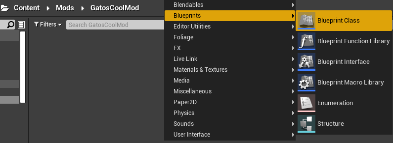
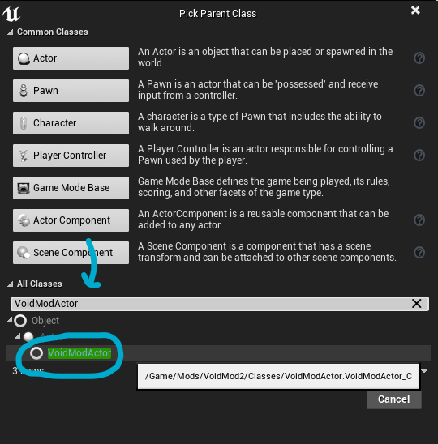
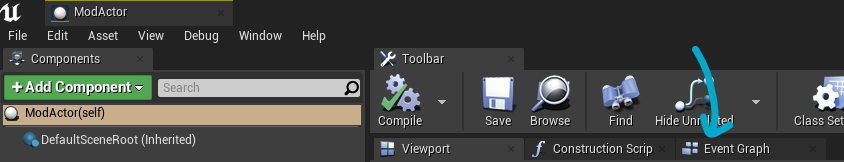
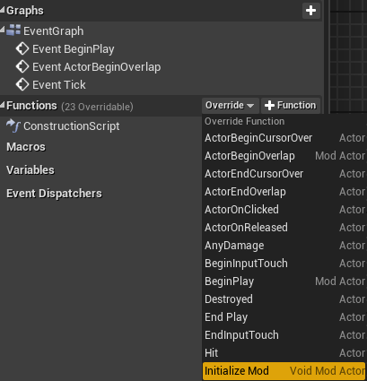
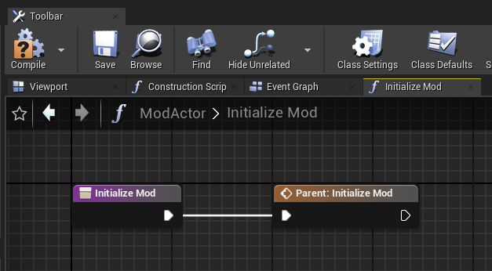
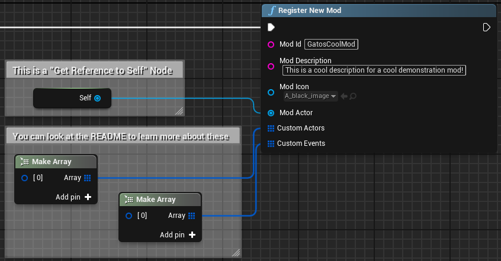

# Creating Your First Mod
## Creating the ModActor
First, open the "Mods" folder in your Unreal Engine Content Browser. This is where your mods will be stored. Right Click an Empty Area and click "New Folder", making sure you name the folder after your mod.

For example, if I wanted to create a mod called "Gato's Cool Mod", I would name this folder `GatosCoolMod`. When you build and export your project, this will be the name of the `.pak` file you provide the Mod Loader with. Simplicity is key, but you can't name your Mod the same as another Mod, so I recommend personalizing your mod folder names.

Afterwards, open your mod folder that you have created and Right Click the Empty Space again, clicking on "Blueprint"

You will be greeted by a "Pick Parent Class" window, where you want to search for "VoidModActor" and click the result, then Select.

Name this new Actor "ModActor". This will be your Mod's heart, its controller. Double Click it to Open the Blueprint Editor. On the new window, look for and click the "Event Graph" tab.

## Registering your Mod
In VoidMod1, you would have to create a "Event PostBeginPlay" node and register your mod there. VoidMod2 does this for you and simplifies the work you have to do by including premade functions for all VoidMod mods through its parent class. If you are moving your VoidMod mod to VoidMod2, do all of your initializing functions using the following:

To start registering your mod, go to the Left side of the window for the Blueprint Editor, and hover over the "Functions" dropdown. Click on the "Override" dropdown that appears, and select "Initialize Mod".

You should see something like this in the center view.

Drag off the arrow after the "Parent: Initialize Mod" node and create a new "Register New Mod" node. Fill in the information VoidMod needs to register your mod and click "Compile"

This is an example of a Register New Mod node:

That is it! You've registered your first Mod for VoidMod2! Use the video tutorial to learn how to export your mod as a `.pak` file and load it in game.
