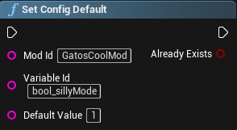
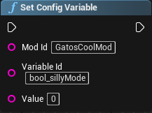
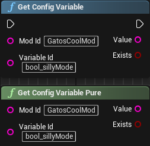
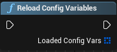
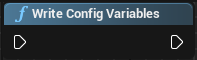
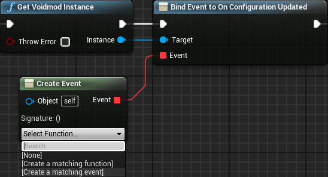
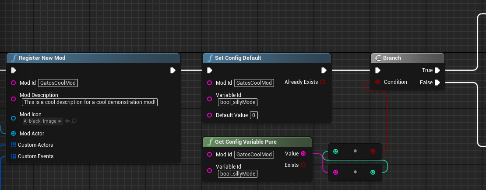

# Mod Configuration Options

If you want to allow users to configure certain aspects of your mod, you can use VoidMod's Config functions. Here are the different Nodes you can use to store or load configuration options.

:::tip Keep In Mind
There are currently two settings types that can be registered, Bools and Inputs.

- Variables that start with bool_ will be configured using a checkmark, and store as a 0 or 1 string
- Other Variables will be configured using a text input, and are stored as an appropriate string
:::

**[Click This To Skip to an Example Implementation](#tutorial-example)**

## Set Config Default

This node is used to set the default value of a configuration variable. If a value exists already, then this node will do nothing, otherwise it will write the value to this variable.

Returns a bool, representative of whether the value exists or was written.

## Set Config Variable

This node is used to set the current value of a configuration variable. If a value exists already, then this node will overwrite it.

## Get Config Variable

This node is used to get the current value of a configuration variable. If a value exists, it will return the value as a string, otherwise it returns a false bool.

:::danger Danger Nodes
The average user should avoid using these nodes, as the above nodes already implement them automatically. Performance can be massively degraded as a result.

## Reload Config Variables

Reloads the Configuration file, and returns an array of loaded Configuration Variables.

## Write Config Variables

Writes loaded variables to the Configuration file.
:::

## Telling the Mod About Changes

If you need to update something in real time when a user changes their preferences, you can bind an event to the configuration change dispatcher as shown here:

This will create an event where you can have the mod update its different variables or functions.

## Tutorial Example

For my example mod, I want to have a "Silly Mode", where when the mod starts, if it is enabled, silly music will play.

If I want the user to be able to configure this option, I will first set a configuration default when the mod registers, and then check if the bool is enabled so that I can play my music.

