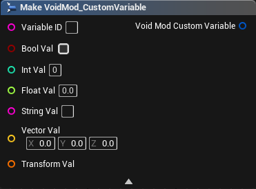
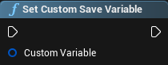
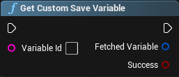
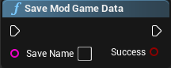
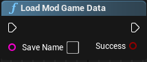

# Custom Save Data

:::note Dr. Dee's Note
This Tutorial assumes you have watched the OLD Tutorial Video and followed the Setup guide for VoidMod2

Please consider watching the Tutorial despite its out of date Blueprint instruction. This tutorial covers the Blueprints only and how to create your ModActor. Packaging, Material Troubleshooting, and more is covered in the Video Tutorial.

VoidMod2 also comes with a README file including a rundown of EVERYTHING you need to know. This tutorial is meant to explain the bare bones basics and differences.

You are also expected to know how to use Unreal Engine's Blueprint Editor, and understand concepts such as Event Tick, Event PostBeginPlay, Parent Classes, and Function Overrides
:::

If you want to save and load data to a player's save file, such as custom stats or event requirements, then you can use VoidMod's Save Data functions. Here are the different Nodes you can use to store or load save data information.

## VoidMod CustomVariable

This is the structure of the VoidMod Save Data variables and is used when saving and loading information based on ID. It has one of each common data types attached to it and can hold multiple values under the same ID as long as the data type of the value is different.

## Set Custom Save Variable

This node takes in the Custom Variable structure and adds it to a cached array of loaded variables.

## Get Custom Save Variable

This node takes in the Variable ID from the Custom Variable Struct and returns the cached Structure as well as a bool indicating whether the structure was found.

:::danger Danger Nodes
The average user should avoid using these nodes, but these can be used technically to cross-analyze save variables. Mod Saves are default written to `<save-name>-MODDED.sav`.

## Save Mod Game Data

Saves the current cached variables to a new save file under the given name.

## Load Mod Game Data

Loads a save file's variables to the cache.
:::

