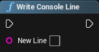
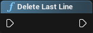
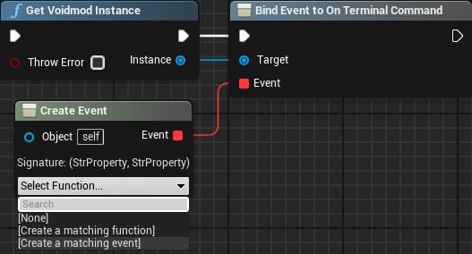
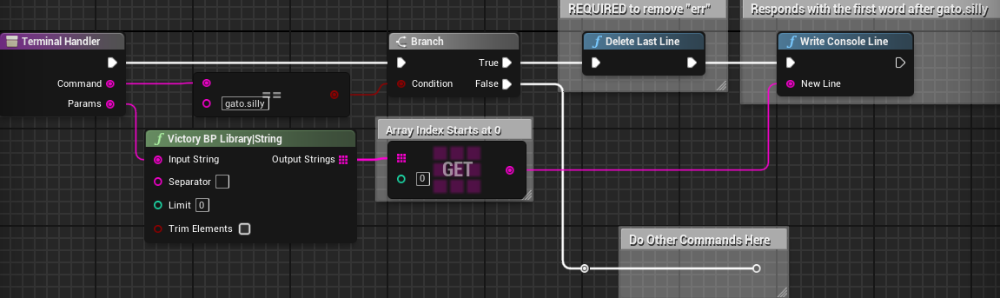

# Adding Terminal Commands

:::note Dr. Dee's Note
This Tutorial assumes you have watched the OLD Tutorial Video and followed the Setup guide for VoidMod2

Please consider watching the Tutorial despite its out of date Blueprint instruction. This tutorial covers the Blueprints only and how to create your ModActor. Packaging, Material Troubleshooting, and more is covered in the Video Tutorial.

VoidMod2 also comes with a README file including a rundown of EVERYTHING you need to know. This tutorial is meant to explain the bare bones basics and differences.

You are also expected to know how to use Unreal Engine's Blueprint Editor, and understand concepts such as Event Tick, Event PostBeginPlay, Parent Classes, and Function Overrides
:::
:::warning
Please note that you cannot overwrite base game commands. You can try deleting their output, but their effects will still apply.
:::

## Write Console Line

This allows you to write any text you want as a line to the in-game Terminal Console. You can use the following color format codes for this:

- `White (default)`
- <code style={{color: 'cyan'}}>&lt;c&gt;Cyan&lt;/&gt;</code>
- <code style={{color: 'yellow'}}>&lt;y&gt;Yellow&lt;/&gt;</code>
- <code style={{color: 'lime'}}>&lt;g&gt;Green&lt;/&gt;</code>
- <code style={{color: 'red'}}>&lt;r&gt;Red&lt;/&gt;</code>

## Delete Last Line

This node is used to delete the last sent line in the terminal, and is useful when creating custom commands, as it allows the Mod Creator to remove the <code style={{color: 'red'}}>&gt; err</code> that shows up by default when invalid commands are received and replace it with their own output.

## Hooking The Terminal Command Handler

To listen for when commands are sent, you have to attach an Event to the Terminal Command Handler from the VoidMod Instance. Simply make a "Get VoidMod Instance" node, and drag another node off of the output to "Bind Event to On Terminal Command". Then, drag the Event input off and choose `Event Dispatchers > Create Event`. From the dropdown, select "Create a Matching Function" (or event).

:::warning
After doing so, if you rename the function, you likely will have to go to the dropdown again and choose the function or event you just made as Unreal Engine is silly like that.
:::

Now, if I wanted to create a command called `gato.silly`, and it took the first parameter and said it back to you, my Terminal Handler graph would look like this:

